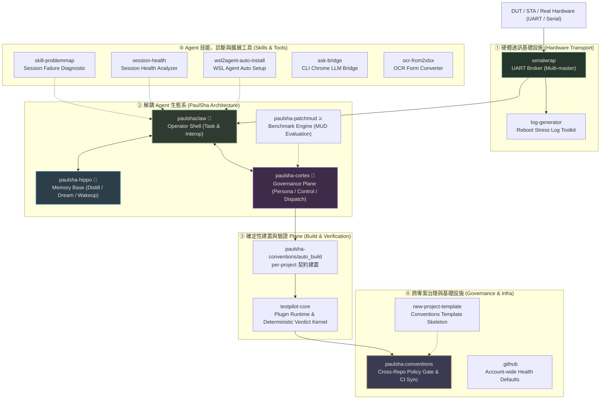
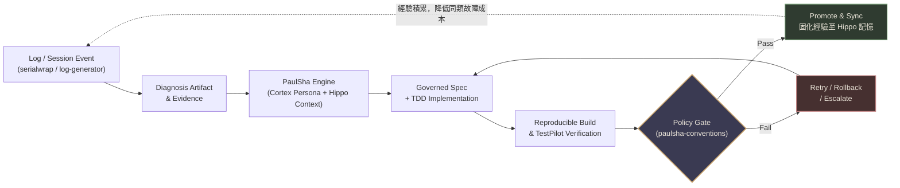

# Paul Haman

**嵌入式系統 (Embedded Systems) · Agentic Engineering · 受治理的自主軟體維護與記憶生態**

我正在構建一套以嵌入式裝置通訊為基礎的受治理自主工程與維護系統。系統涵蓋底層硬體 Transport 通訊、可解耦的 Agent 架構（Operator Shell / 記憶基座 / 治理平面 / 確定性評測），以及跨專案 Policy-as-Code 治理規範。

> **核心願景**：目標不是讓 AI 自己宣稱「修好了」，而是讓診斷、變更、建置、驗證與治理都有據可查，交由 deterministic gate 確定性驗證放行，並將除錯經驗固化回傳至記憶系統，實現持續省力的工程閉環。

---

## 系統層級與關係 (System Architecture)

---

## 公開專案矩陣 (Public Repositories Matrix)

### 1. Agent 生態與治理核心 (PaulSha Architecture & Agent OS)

| Repo | 主要責任 | 技術亮點 / 特色 | 狀態 Snapshot |
|---|---|---|---:|
| [`paulshaclaw`](https://github.com/hamanpaul/paulshaclaw) | 個人 Agent OS 的 **Operator Shell** (破蝦哥 🦞) | 保留 Shell/Integration/Operator 介面；派工與記憶已解耦至外部平面 | Operator Core |
| [`paulsha-hippo`](https://github.com/hamanpaul/paulsha-hippo) | 跨 LLM Vendor 記憶與經驗固化基座 (🦛 Hippo) | Session 自動蒸餾成原子筆記、睡眠期（Dream）整理、隔天喚醒（Wakeup） Context 回灌 | v0.1.0 已發布 |
| [`paulsha-cortex`](https://github.com/hamanpaul/paulsha-cortex) | Harness 治理平面三件套 (🧠 Cortex) | Persona 護欄契約 + Coordinator 派工 + `.paulsha/control.json` 檔案控制面 | 治理核心 |
| [`paulsha-patchmud`](https://github.com/hamanpaul/paulsha-patchmud) | 純文字回合制 Coding-Agent 評測框架 (⚔️ MUD) | 零 LLM 裁判！以 Issue 為關卡、Patch 為動作，透過確定性測試進行位元級重播評分 | 評測實驗室 |

### 2. 硬體通訊與驗證基座 (Hardware Transport & Verification)

| Repo | 主要責任 | 技術亮點 / 特色 | 狀態 Snapshot |
|---|---|---|---:|
| [`serialwrap`](https://github.com/hamanpaul/serialwrap) | 多 Master UART console 仲裁與 AI 通訊基礎設施 | 單一 UART 多方安全共享 universal multiplexing，較原生 tty 提升 ~2× 速度 | 穩定運行 |
| [`log-generator`](https://github.com/hamanpaul/log-generator) | Reboot / Power Cycle 壓測測試日誌產生器 | 提供 `serialwrap` 重啟壓力測試之仿真日誌串流與工具組 | 輔助工具 |
| [`testpilot-core`](https://github.com/hamanpaul/testpilot-core) | Host 執行階段與確定性驗證 Kernel | Plugin-based 嵌入式驗證框架、獨立狀態審計、嚴格 CLI 門禁 | Core 穩定 |

### 3. 跨專案治理與 CI 規範 (Governance & CI Infrastructure)

| Repo | 主要責任 | 技術亮點 / 特色 | 狀態 Snapshot |
|---|---|---|---:|
| [`paulsha-conventions`](https://github.com/hamanpaul/paulsha-conventions) | 跨 Repo Policy 守門員與規範驗證器 | 定義 `auto_build` 重現契約、版本/Changelog 規範、PR Gate 與 Workflow 鎖定 | Policy v1.0.x |
| [`new-project-template`](https://github.com/hamanpaul/new-project-template) | 符合 `paulsha-conventions` 的專案骨架 | 提供 GitHub Template、最小 bootstrap、policy metadata 與 CI 檢查工作流 | 範本骨架 |
| [`.github`](https://github.com/hamanpaul/.github) | 帳號級社群健康度與預設檔案 | 為 `hamanpaul/*` 儲存庫提供統一社群規範與 GitHub Health Defaults | 帳號基座 |

### 4. Agent 技能與 CLI 環境維護 (Skills, CLI Diagnostics & Setup)

| Repo | 主要責任 | 類別 / 說明 |
|---|---|---|
| [`skill-problemmap`](https://github.com/hamanpaul/skill-problemmap) | Session 異常診斷 Agent Skill | 讓 Agent CLI 能對自身 Session 失敗與 `turn_aborted` 進行復盤與診斷 |
| [`session-health`](https://github.com/hamanpaul/session-health) | Agent CLI Session 健康度分析工具 | 診斷 Agent 執行軌跡、Token 耗用與上下文異常 |
| [`wsl2agent-auto-install`](https://github.com/hamanpaul/wsl2agent-auto-install) | WSL2 AI Agent CLI 自動化安裝腳本 | 快速開箱與建置 AI Agent (Codex & Copilot) 於 WSL2 環境 |
| [`skill-confluence-limited-wr`](https://github.com/hamanpaul/skill-confluence-limited-wr) | Confluence 受限寫入 Agent Skill | 基於 Atlassian-skills 延伸之受控 Confluence 文件更新技能 |

### 5. 開源工具與側翼專案 (Open Source Utilities & Applications)

| Repo | 主要責任 | 語言 / 技術 |
|---|---|---|
| [`ask-bridge`](https://github.com/hamanpaul/ask-bridge) | 終端機網頁 Chrome LLM Bridge | Rust 實作，在 CLI 透過真實 Chrome 瀏覽器調用 ChatGPT / Gemini 答題 |
| [`ocr-from2xlsx`](https://github.com/hamanpaul/ocr-from2xlsx) | 手寫表格 OCR 轉換工具 | Python 實作之客製化 OCR 手寫表格轉 Excel 工具 |
| [`mini-auto`](https://github.com/hamanpaul/mini-auto) | 自動化模組與控制工具 | C++ 實作之輕量自動化專案 |
| [`openclaw-obsidian-deploy`](https://github.com/hamanpaul/openclaw-obsidian-deploy) | Obsidian 筆記維護容器部署 | Shell 實作之 Dockerfile 部署環境 |
| [`custom-claw-tools`](https://github.com/hamanpaul/custom-claw-tools) | Agent 工具擴充組 | Python 實作之環境工具集 |

---

## 關鍵技術柱石 (Key Technical Pillars)

### 1. Hardware Transport
- **`serialwrap`**：將 UART 與實體裝置通訊包裝為上層測試與診斷系統可穩定採用的 Broker。解決多 Agent 爭搶 Console 的衝突難題，實現「**One UART. Many masters. Zero collisions.**」。

### 2. Decoupled PaulSha Agent Architecture
將 Agent 系統徹底解耦為四大專精平面：
- **Operator Shell (`paulshaclaw` 🦞)**：負責互動介面、任務編排與工具調用。
- **Memory Base (`paulsha-hippo` 🦛)**：受海馬迴啟發，自動將對話蒸餾為原子筆記（Distillation），於背景離線期進行結構整理（Dream），並於次日任務發起時主動喚醒回灌（Wakeup Context）。
- **Governance Plane (`paulsha-cortex` 🧠)**：提供硬性 Guardrail，透過 Persona 邊界契約與 `.paulsha/control.json` 控制面約束 Agent 的變更行為。
- **Benchmark Engine (`paulsha-patchmud` ⚔️)**：以純文字 MUD 評測模式，透過 Bit-exact 重播與實機測試，對 Agent 的經濟性、火力與控場力進行零 LLM 裁判的公正量測。

### 3. Deterministic Build & Verification
- **`auto_build` (`paulsha-conventions`)**：經由 `.paul-project.yml` 宣告 per-project 的可重現建置與測試步驟。
- **`testpilot-core`**：提供確定性 Verdict 核心。AI Agent 可提出診斷報告與 Patch 建議，但是否判定 Pass / Fail 完全由 TestPilot Runtime 獨立執行與審計。

---

## 受治理的自動化維護閉環 (Governed Closed-Loop Maintenance Flow)

---

## 工程原則 (Engineering Principles)

1. **Artifact-First & Evidence-Driven**：所有診斷與修補必須附帶 log、trace 或測試案例證據，無 artifact 即視同未完成。
2. **Deterministic Verdict**：AI 不得自我審查放行修改。測試結果與品質 gate 必須由獨立的驗證核心（TestPilot）裁決。
3. **Decoupled Architecture**：將 Shell、Memory、Governance 與 Evaluation 模組解耦，保持極致靈活性與可移植性。
4. **Bounded Autonomy & Fail-Close**：Agent 行為受嚴格 Persona 與 Control File 約束，遇到安全、密鑰或治理異常時強制 Fail-close。
5. **Zero LLM-Judge Evaluation**：評測與基準（Benchmark）回絕盲目使用大模型進行主觀打分，一律以確定性測試、位元重播與測試通過率評定。
6. **Continuous Experience Growth**：每次 Incident 的診斷與驗證結果均固化回 Hippo 記憶庫，避免重複除錯。

---

## 目前關注方向 (Current Focus)

- 完善 **PaulSha Agent 生態** 跨 Repo 平面協作 (`paulshaclaw` + `paulsha-hippo` + `paulsha-cortex`) 之 Golden-Path 案例。
- 推進 **TestPilot** 確定性驗證 Kernel 與 `paulsha-conventions` 跨 Repo 自動化治理。
- 優化 **`serialwrap`** 多 Agent 通訊與測試日誌自動感測。
