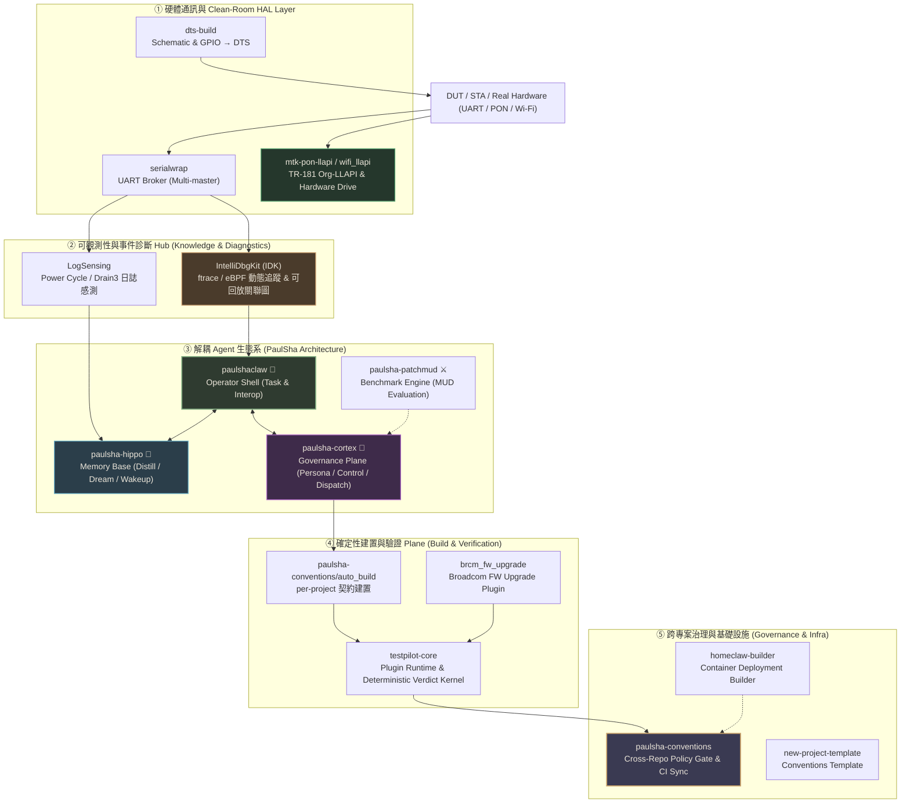
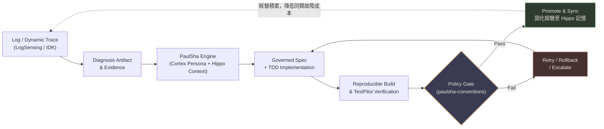

# Paul Haman

**嵌入式系統 (Embedded/prplOS/HAL) · Agentic Engineering · 受治理的自主軟體維護與記憶生態**

我正在構建一套以嵌入式裝置（prplOS / OpenWrt / Linux Kernel / Hardware HAL）為核心的受治理自主工程與維護系統。系統涵蓋下層硬體 Transport 與 Clean-Room HAL 驅動、長期 Log 感知與動態追蹤（ftrace / eBPF）、可解耦的 Agent 架構（Operator Shell / 記憶基座 / 治理平面 / 評測驗證），以及跨專案 Policy-as-Code 治理規範。

> **核心願景**：目標不是讓 AI 自己宣稱「修好了」，而是讓診斷、變更、建置、驗證與治理都有據可查，交由 deterministic gate 確定性驗證放行，並將除錯經驗固化回傳至記憶系統，實現持續省力的工程閉環。

---

## 系統層級與關係 (System Architecture)

---

## 核心專案矩陣 (Core Repositories)

### 1. 硬體通訊與 Clean-Room HAL (Hardware & HAL Layer)

| Repo | 主要責任 | 技術亮點 / 授權 | 狀態 Snapshot |
|---|---|---|---:|
| [`serialwrap`](https://github.com/hamanpaul/serialwrap) | 多 Master UART console 仲裁與 AI 通訊基礎設施 | 單一 UART 多方安全共 universal multiplexing，較原生 tty 提升 ~2× 速度 | 穩定運行 |
| [`mtk-pon-llapi`](https://github.com/hamanpaul/mtk-pon-llapi) | Clean-room prpl PON HAL agent (Airoha AN7589) | 接軌 prplOS 4.2.1 TR-181 `Device.XPON.*` HLAPI 至 `blapi_*` | BSD-2-Clause-Patent |
| [`wifi_llapi`](https://github.com/hamanpaul/wifi_llapi) | 多測試環境無線驅動與驗證架構 | TestPilot Wi-Fi 測試驅動插件基礎 | 整合中 |
| [`dts-build`](https://github.com/hamanpaul/dts-build) | 自動解析 schematic 與 GPIO 表生成 DTS | 晶片與板級 Device Tree 自動化構築工具 | 開發中 |
| [`log-generator`](https://github.com/hamanpaul/log-generator) | Reboot / Power Cycle 壓測測試日誌產生器 | 提供 `serialwrap` 重啟壓力測試之仿真日誌串流 | 輔助工具 |

### 2. 可觀測性與事件診斷 Hub (Knowledge & Diagnostics)

| Repo | 主要責任 | 技術亮點 / 授權 | 狀態 Snapshot |
|---|---|---|---:|
| [`IntelliDbgKit`](https://github.com/hamanpaul/IntelliDbgKit) | 嵌入式除錯閉環與視覺化追蹤平台 | 靜態 Code/ODL 索引 + 動態 ftrace/eBPF 追蹤，支援可回放關聯圖與多 Agent 共識門禁 | PI Core 核心 |
| [`logsensing`](https://github.com/hamanpaul/logsensing) | 嵌入式巨量日誌感知與 AI 根因診斷 | Drain3 動態模板探勘 + Bootloader 錨點串流切割，支援 Boot Cycle 壓測分析 | 穩定運行 |

### 3. 解耦 Agent 生態系 (PaulSha Architecture)

| Repo | 主要責任 | 技術亮點 / 授權 | 狀態 Snapshot |
|---|---|---|---:|
| [`paulshaclaw`](https://github.com/hamanpaul/paulshaclaw) | 個人 Agent OS 的 **Operator Shell** (破蝦哥 🦞) | 保留 Shell/Integration/Operator 介面；派工與記憶已解耦出外部平面 | Operator Core |
| [`paulsha-hippo`](https://github.com/hamanpaul/paulsha-hippo) | 跨 LLM Vendor 記憶與經驗固化基座 (🦛 Hippo) | Session 自動蒸餾成原子筆記、睡眠期（Dream）整理、隔天喚醒（Wakeup） context 回灌 | v0.1.0 已發布 |
| [`paulsha-cortex`](https://github.com/hamanpaul/paulsha-cortex) | Harness 治理平面三件套 (🧠 Cortex) | Persona 護欄契約 + Coordinator 派工 + `.paulsha/control.json` 檔案控制面 | 治理核心 |
| [`paulsha-patchmud`](https://github.com/hamanpaul/paulsha-patchmud) | 純文字回合制 Coding-Agent 評測框架 (⚔️ MUD) | 零 LLM 裁判！以 Issue 為關卡、Patch 為動作，透過確定性測試進行位元級重播評分 | 評測實驗室 |

### 4. 確定性建置與驗證 Plane (Build & Verification)

| Repo | 主要責任 | 技術亮點 / 授權 | 狀態 Snapshot |
|---|---|---|---:|
| [`testpilot-core`](https://github.com/hamanpaul/testpilot-core) | Host 執行階段與確定性驗證 Kernel | Plugin-based 嵌入式驗證框架、獨立狀態審計、嚴格 CLI 門禁 | Core 穩定 |
| [`brcm_fw_upgrade`](https://github.com/hamanpaul/brcm_fw_upgrade) | TestPilot Broadcom 韌體升級插件 | 自動化廣達/博通韌體刷寫與重啟驗證 | 插件運行中 |
| [`paulsha-conventions`](https://github.com/hamanpaul/paulsha-conventions) | 跨 Repo Policy 守門員與規範驗證器 | 定義 `auto_build` 重現契約、版本/Changelog 規範、PR Gate 與 Workflow 鎖定 | Policy v1.0.x |

### 5. 基礎設施、技能與擴展應用 (Infra, Skills & Domain Apps)

| Repo | 主要責任 | 技術亮點 / 類別 |
|---|---|---|
| [`homeclaw-builder`](https://github.com/hamanpaul/homeclaw-builder) | Homeclaw 容器化部署構建器 | 統合 Dockerfile、工具清單、家用服務與技能為單一 Source of Truth |
| [`new-project-template`](https://github.com/hamanpaul/new-project-template) | 符合 `paulsha-conventions` 的專案骨架 | 提供最小 bootstrap、policy metadata 與 CI 檢查工作流 |
| [`skill-problemmap`](https://github.com/hamanpaul/skill-problemmap) | Session 異常診斷 Skill | 讓 Agent CLI 能對自身 Session 失敗與 `turn_aborted` 進行復盤與診斷 |
| [`session-health`](https://github.com/hamanpaul/session-health) | Agent CLI Session 健康度分析工具 | 診斷 Agent 執行軌跡、Token 耗用與上下文異常 |
| [`wsl2agent-auto-install`](https://github.com/hamanpaul/wsl2agent-auto-install) | WSL2 AI Agent CLI 自動化安裝腳本 | 快速開箱與建置 AI Agent (Codex & Copilot) 於 WSL2 環境 |
| [`health-integrator`](https://github.com/hamanpaul/health-integrator) | Android 運動與健康資料整合 App | Google Health Connect 體重/體脂同步 NAS，復刻 MOHOT 重訓紀錄對齊 Garmin |
| [`ask-bridge`](https://github.com/hamanpaul/ask-bridge) | 終端機網頁 Chrome LLM Bridge (Rust) | 在 CLI 透過真實 Chrome 瀏覽器調用 ChatGPT / Gemini 答題 |

---

## 關鍵技術柱石 (Key Technical Pillars)

### 1. Hardware Transport & Clean-Room HAL
- **`serialwrap`**：將 UART 與實體裝置通訊包裝為上層測試與診斷系統可穩定採用的 Broker。解決多 Agent 爭搶 Console 的衝突難題，實現「**One UART. Many masters. Zero collisions.**」。
- **`mtk-pon-llapi`**：採用 Clean-room 方式（BSD-2-Clause-Patent），將 Airoha AN7589 的 PON 底層 `blapi_*` 抽象並產出符合 prplOS 4.2.1 標準 TR-181 `Device.XPON.*` HLAPI 的 vendor-neutral ubus 介面。

### 2. Observability & Controlled Closed-Loop Debugging
- **`logsensing`**：針對 Power Cycle 壓力測試的巨量日誌，採用 Drain3 動態探勘剝離常數模板，配合 Bootloader 錨點串流切割，實現自動化異常定位。
- **`IntelliDbgKit (IDK)`**：結合靜態 Schema/ODL/Code 索引與動態 ftrace/eBPF 追蹤，繪製可回放之函數呼叫與資料流關聯圖，配合多 Agent 共識與 Veto Gate，確保除錯與修復具備完整證據鏈。

### 3. Decoupled PaulSha Agent Architecture
將 Agent 系統徹底解耦為三大專精平面：
- **Operator Shell (`paulshaclaw` 🦞)**：負責互動介面、任務編排與工具調用。
- **Memory Base (`paulsha-hippo` 🦛)**：受海馬迴啟發，自動將對話蒸餾為原子筆記（Distillation），於背景離線期進行結構整理（Dream），並於次日任務發起時主動喚醒回灌（Wakeup Context）。
- **Governance Plane (`paulsha-cortex` 🧠)**：提供硬性 Guardrail，透過 Persona 邊界契約與 `.paulsha/control.json` 控制面約束 Agent 的變更行為。
- **Benchmark Engine (`paulsha-patchmud` ⚔️)**：以純文字 MUD 評測模式，透過 Bit-exact 重播與實機測試，對 Agent 的經濟性、火力與控場力進行零 LLM 裁判的公正量測。

### 4. Deterministic Build & Verification
- **`auto_build` (`paulsha-conventions`)**：經由 `.paul-project.yml` 宣告 per-project 的可重現建置與測試步驟。
- **`testpilot-core`**：提供確定性 Verdict 核心。AI Agent 可提出診斷報告與 Patch 建議，但是否判定 Pass / Fail 完全由 TestPilot Runtime 獨立執行與審計。

---

## 受治理的自動化維護閉環 (Governed Closed-Loop Maintenance Flow)

---

## 工程原則 (Engineering Principles)

1. **Artifact-First & Evidence-Driven**：所有診斷與修補必須附帶 log、trace、call graph 或測試案例證據，無 artifact 即視同未完成。
2. **Deterministic Verdict**：AI 不得自我審查放行修改。測試結果與品質 gate 必須由獨立的驗證核心（TestPilot）裁決。
3. **Decoupled Architecture**：將 Shell、Memory、Governance 與 Evaluation 模組解耦，保持極致靈活性與可移植性。
4. **Bounded Autonomy & Fail-Close**：Agent 行為受嚴格 Persona 與 Control File 約束，遇到安全、密鑰或治理異常時強制 Fail-close。
5. **Zero LLM-Judge Evaluation**：評測與基準（Benchmark）回絕盲目使用大模型進行主觀打分，一律以確定性測試、位元重播與測試通過率評定。
6. **Continuous Experience Growth**：每次 Incident 的診斷與驗證結果均固化回 Hippo 記憶庫，避免重複除錯。

---

## 目前關注方向 (Current Focus)

- 推進 **prplOS / OpenWrt** 平台上的可觀測性鏈條（`IntelliDbgKit` ftrace / eBPF + `logsensing`）。
- 完善 **PaulSha Agent 生態** 跨 Repo 平面協作 (`paulshaclaw` + `paulsha-hippo` + `paulsha-cortex`) 之 Golden-Path 案例。
- 持續深化 Clean-Room Embedded HAL (`mtk-pon-llapi`) 與 `paulsha-conventions` 跨 Repo 自動化治理。
